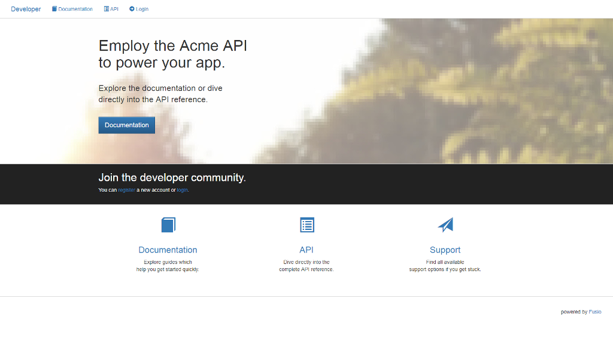

Consumer
========

Fusio provides a default consumer implementation located at ``/developer`` which 
provides a basic admin panel to manage and authorize apps. It is also possible
to integrate it into an existing application. In the following an explanation 
how to authorize an app.

Authorization code
------------------

At first you have to redirect the client to the consumer endpoint containing
the app key, redirect uri and the needed scopes i.e.: 
``/developer/auth?response_type=code&client_id=[key]&redirect_uri=[url]&scope=foo,bar``.
After the user has authenticated he approves or denies the access. If he accepts
the user gets redirected to the provided ``redirect_uri``. Note the ``redirect_uri`` 
must have the same host as the url which was provided for the app. The callback 
contains a GET parameter ``code`` which can be exchanged for an access token at 
the ``/authorization/token`` endpoint.

Implicit
--------

Mostly used for javascript apps. Like in the authorization code flow the app
redirects the user to the consumer endpoint i.e.:
``/developer/auth?response_type=token&client_id=[key]&redirect_uri=[url]&scope=foo,bar``
If the user has authenticated and approved the app the user gets redirected to
the ``redirect_uri``. The callback contains the access token in the fragment 
component. The access tokens which are issued through the implicit grant have 
usually a much shorter life time because they are more insecure. It is also 
possible to deactivate the implicit grant through the configuration.

Password
--------

A user can use the password grant to obtain directly an access token with 
their username and password. Therefor he has to send a direct request to the 
``/authorization/token`` endpoint.

