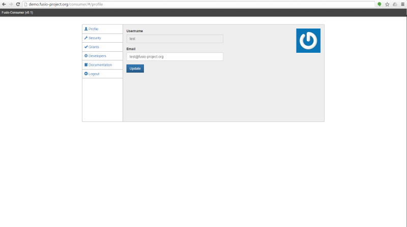

Overview
========

This chapter gives a high level overview what the Fusio system provides and how
the application is structured. Lets take a look at the components which are 
provided by Fusio:

.. image:: _static/fusio-overview.png

Fusio API
---------

If you install a Fusio system it setups the default API with that it is possible
to manage the complete system. Because of that Fusio has some reserved paths 
which are needed by the system.

* ``/backend``
  Endpoints for the backend app
* ``/consumer``
  Endpoints for the consumer app
* ``/doc``
  Endpoints for the documentation app
* ``/authorization``
  Endpoints for the consumer to get i.e. information about the user itself and 
  to revoke an obtained access token
* ``/export``
  Endpoints to export the documentation into other formats i.e. swagger

All following apps are working with the API. Because of that it is also really 
easy to integrate Fusio into an existing system since you can call the endpoints 
from your application.

Backend App
-----------

.. image:: _static/backend.png

The backend app is the app with that you can configure the system. It gives you 
the possibility to define the routes of your API and which actions should be 
executed. The app is located at ``/backend.htm``.

Consumer App
------------

The consumer app is used by the consumer of the API. Those are either app 
developers which want to consumer your API or normal end users. At the consumer
app the user can update basic account informations and revoke the access of 
authorized apps. The user can also create new apps. Through the created app he 
obtains an app key and secret with that it is possible to get an access token to 
access protected parts of the API. The app is located at ``/consumer/``.

Documentation App
-----------------

.. image:: _static/documentation.png

The documentation app simply provides an overview of all available endpoints. 
It is possible to export the API definition into other schema formats like i.e. 
Swagger. The app is located at ``/documentation/``.
