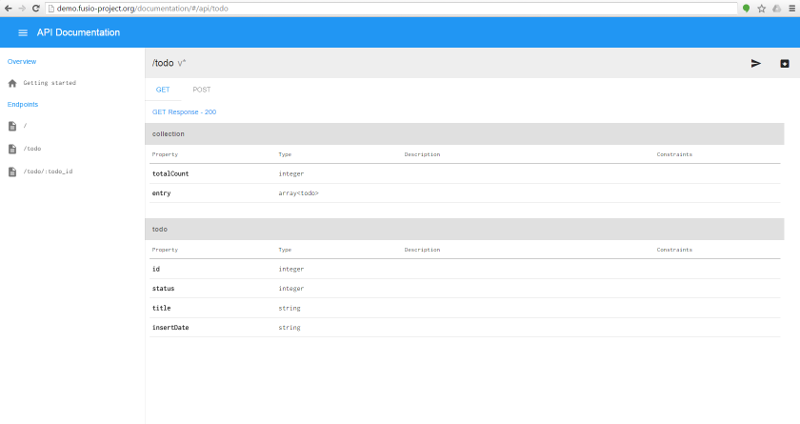
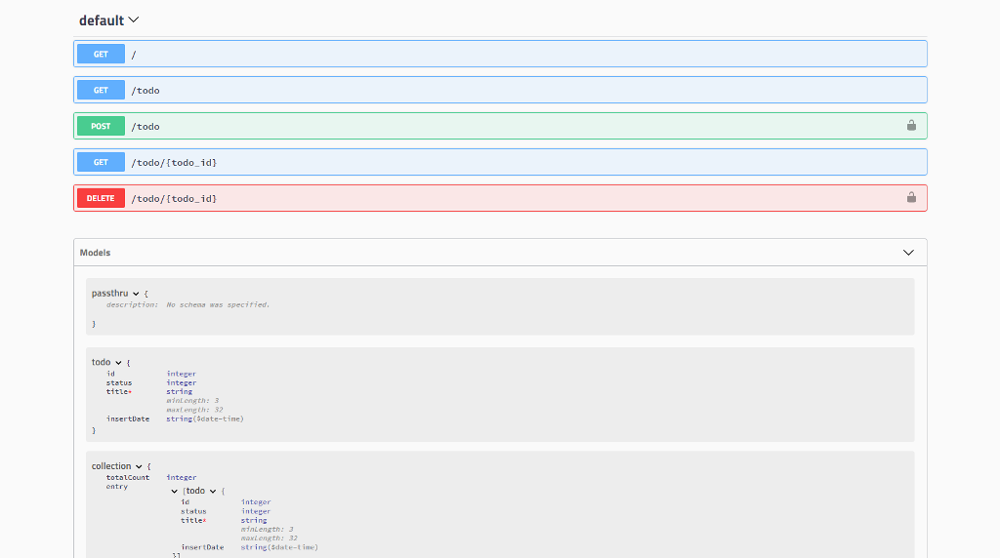

Overview
========

About
-----

Fusio is an open source API management platform which helps to build and manage 
RESTful APIs. We think that there is a huge potential in the API economy. 
Whether you need an API to expose your business functionality, build micro 
services, develop SPAs or Mobile-Apps. Because of this we think that Fusio is a 
great tool to simplify building such APIs. More information on 
http://www.fusio-project.org/

Features
--------

Fusio covers all important aspects of the API lifecycle so you can concentrate
on building the actual business logic of your API.

* **Versioning**

  It is possible to define different versions of your endpoint. A concrete 
  version can be requested through the ``Accept`` header i.e. ``application/vnd.acme.v1+json``
* **Documentation**

  Fusio generates automatically a documentation of the API endpoints based on 
  the provided schema definitions.
* **Validation**

  Fusio uses the standard JSONSchema to validate incoming request data.
* **Authorization**

  Fusio uses OAuth2 for API authorization. Each app can be limited to scopes to 
  request only specific endpoints of the API.
* **Analytics**

  Fusio monitors all API activities and shows them on a dashboard so you always 
  know what is happening with your API. 
* **Rate limiting**

  It is possible to limit the requests to a specific threshold.
* **Specifications**

  Fusio generates different specification formats for the defined API endpoints
  i.e. OAI (Swagger), RAML.
* **User management**

  Fusio provides an API where new users can login or register a new account 
  through GitHub, Google, Facebook or through normal email registration.
* **Logging**

  All errors which occur in your endpoint are logged and are visible at the 
  backend including all information from the request.
* **Connection**

  Fusio provides an `adapter`_ system to connect to external services. By 
  default we provide the HTTP and SQL connection type but there are many other 
  types available i.e. MongoDB, Amqp, Cassandra.
* **Migration**

  Fusio has a migration system which allows you to change the database schema
  on deployment.
* **Testing**

  Fusio provides an api test case wherewith you can test every endpoint 
  response without setting up a local web server.

Basically with Fusio you only have to define the schema (request/response) of 
your API endpoints and implement the business logic. All other aspects are 
covered by Fusio.

Development
-----------

Fusio provides two ways to develop an API. The first way is to build API 
endpoints only through the backend interface by using all available actions.
Through this you can solve already many tasks especially through the usage of
the `v8 action`_.

The other way is to use the deploy mechanism. Through this you can use normal
PHP files to implement your business logic and thus you have ability to use the
complete PHP ecosystem. Therefor you need to define a ``.fusio.yml`` 
`deploy file`_ which specifies the available routes and actions of the system. 
This file can be deployed with the following command:

.. code-block:: text
    
    php bin/fusio deploy

The action of each route contains the source which handles the business logic. 
This can be i.e. a simple php file, php class or a url. More information in the 
``src/`` folder. In the following an example action to build an API response 
from a database:

.. code-block:: php
    
    <?php
    /**
     * @var \Fusio\Engine\ConnectorInterface $connector
     * @var \Fusio\Engine\RequestInterface $request
     * @var \Fusio\Engine\Response\FactoryInterface $response
     * @var \Fusio\Engine\ProcessorInterface $processor
     * @var \Psr\Log\LoggerInterface $logger
     * @var \Psr\SimpleCache\CacheInterface $cache
     */
    
    /** @var \Doctrine\DBAL\Connection $connection */
    $connection = $connector->getConnection('Default-Connection');
    
    $count   = $connection->fetchColumn('SELECT COUNT(*) FROM app_todo');
    $entries = $connection->fetchAll('SELECT * FROM app_todo WHERE status = 1 ORDER BY insertDate DESC LIMIT 16');
    
    return $response->build(200, [], [
        'totalResults' => $count,
        'entry' => $entries,
    ]);

In the code we get the ``Default-Connection`` which we have defined previously 
in our ``.fusio.yml`` deploy file. In this case the connection returns a
``\Doctrine\DBAL\Connection`` instance but we have already many adapters to 
connect to different services. Then we simply fire some queries and return the 
response.

Backend
-------

Fusio provides several apps which work with the internal backend API. These apps 
can be used to manage and work with the API. This section gives a high level 
overview what the Fusio system provides and how the application is structured. 
Lets take a look at the components which are provided by Fusio:

.. image:: _static/overview.png

API
^^^^

If you install a Fusio system it setups the default API. Through the API it is 
possible to manage the complete system. Because of that Fusio has some reserved 
paths which are needed by the system.

* ``/backend``

  Endpoints for the system configuration
* ``/consumer``

  Endpoints for the consumer i.e. register new accounts or create new apps 
* ``/doc``

  Endpoints for the documentation
* ``/authorization``

  Endpoints for the consumer to get i.e. information about the user itself and 
  to revoke an obtained access token
* ``/export``

  Endpoints to export the documentation into other formats i.e. swagger

Apps
----

The following apps are working with the Fusio API.

Backend
^^^^^^^

.. image:: _static/backend.png

The backend app is the app where the administrator can configure the system. The 
app is located at ``/fusio/``.

Developer
^^^^^^^^^

.. image:: _static/developer.png

The developer app is designed to quickly setup an API program where new 
developers can register and create/manage their apps. The app is located at 
``/developer/``.

Documentation
^^^^^^^^^^^^^

The documentation app simply provides an overview of all available endpoints. 
It is possible to export the API definition into other schema formats like i.e. 
Swagger. The app is located at ``/documentation/``.

Swagger-UI
^^^^^^^^^^

The `swagger-ui`_ app renders a documentation based on the OpenAPI 
specification. The app is located at `/swagger-ui/`.

.. _adapter: http://www.fusio-project.org/adapter
.. _v8 action: https://www.fusio-project.org/documentation/v8
.. _deploy file: http://fusio.readthedocs.io/en/latest/deploy.html
.. _swagger-ui: https://github.com/swagger-api/swagger-ui
