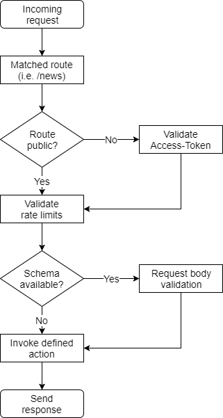

Request lifecycle
=================

To give you a first overview, every request which arrives at Fusio goes through
the following lifecycle:

Fusio tries to assign the incoming request to a fitting route. The route 
contains all schema information about the incoming request and outgoing 
responses. Those schemas are also used at the documentation which is 
automatically available. If a request schema was provided the incoming request 
body gets validated after this schema. In case everything is ok the action 
which is assigned to the route gets executed.

An action represents the code which handles an incoming request and produces a 
response. Each action can use connections to accomplish this task. A connection 
uses a library which helps to work with a remote service. I.e. the SQL 
connection uses the Doctrine DBAL library to work with a database (it returns
a ``Doctrine\DBAL\Connection`` instance). A connection always returns a fully 
configured object so you never have to deal with any credentials in an action. 
Besides that there are already many different actions available which you can 
use i.e. to create an API based on a database table.

With Fusio we want to remove as many layers as possible so that you can work
in your action directly with a specific library. Because of this Fusio has no 
model or entity system like many other frameworks, instead we recommend to write
plain SQL in case you work with a relational database. We think that building API 
endpoints based on models/entities limits the way how you would design a 
response. You only need to describe the request and response in the JSON schema 
format. This schema is then the contract of your API endpoint, how you produce 
this response technically is secondary. Fusio provides the mentioned 
connections, which help you to create complete customized responses based on 
complicated SQL queries, message queue inserts or multiple remote HTTP calls.
