IIS
===

Install PHP into IIS
--------------------

https://docs.microsoft.com/en-us/iis/application-frameworks/install-and-configure-php-on-iis/install-and-configure-php

A useful tool for configuring PHP is the install PHP Manager:

https://www.iis.net/downloads/community/2018/05/php-manager-150-for-iis-10

Note that PHP versions deployed by PHP do not offer the lastest versions available
and so installation of later PHP versions will need to be performed manually.
The PHP version for a site can be registered through PHP Manager.

Deploy Fusio Files on IIS
-------------------------

Decide which folder you wish to install the application in
e.g. ``C:\webapps\fusio.localhost.local\``
e.g. ``C:\webapps\fusio.localhost.local\www\cache``
Download the release and unzip into the target folder:
e.g. ``C:\webapps\fusio.localhost.local\``

Permissions
^^^^^^^^^^^

Ensure that the user account IUSR has read permissions to this folder and all
subfolders. Ensure that the user account IUSR had read/write permissions on
cache folder

Configuring IIS for Local Development
-------------------------------------

Many of the IIS settings apply for a production ISS implementation also.

* Setting up a Local Domain
* Adding a Website to IIS
* Confirm PHP on IIS Website
* Confirm Request Methods
* Setting Up Url Rewrite
* Debugging with xDebug

Setting Up a Local Domain
^^^^^^^^^^^^^^^^^^^^^^^^^

For local development update your hosts file to point to your local IIS web server.
Pick a local domain name that ends in ``.local`` as browsers will complain that
the site is not secure if you choose a domain ending in any other suffix. Add the
following entry in the hosts file located at ``C:\Windows\System32\drivers\etc\hosts``
(you will need to have opened an editor as an Administrator as this is an admin
secured file): ``127.0.0.1 fusio.localhost.local``
Now the url ``http://fusio.localhost.local`` it will resolve to your local IIS
webserver.

Adding Website to IIS
^^^^^^^^^^^^^^^^^^^^^

In Internet Information Services Manager, expand the root node and right click
"Sites" and "Add Website" to configure a new site.

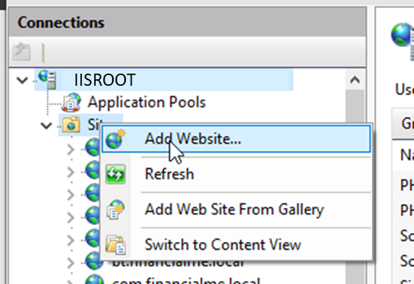

Add a Site name of ``fusio.localhost.local``. An application pool of the same
name will be created automatically.

Set the physical path to the public folder within your Fusio folder:
e.g. ``C:\webapps\fusio.localhost.local\public``

Set the host name to ``fusio.localhost.local`` to enable IIS to differentiate
between the different requests that it might receive on the one web server.

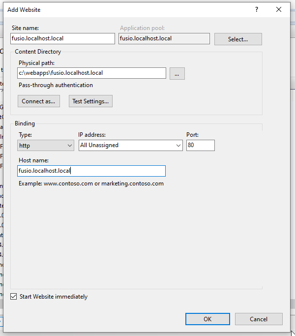

Optionally, the application pool for the Fusio installation can be configured to
bypass the .net handling by clicking the "Application Pools" node in IIS manager.
Double clicking the application pool e.g. ``fusio.localhost.local`` and setting
the .NET CLR version to "No managed code" 

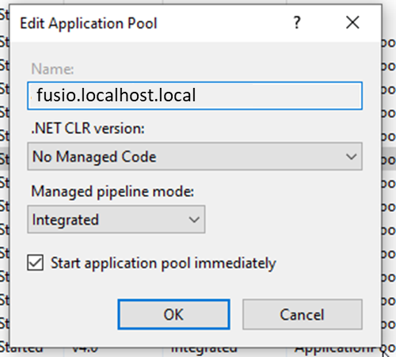

Confirm PHP on IIS
^^^^^^^^^^^^^^^^^^

Ensure that the required PHP version is mapped to you site using PHP Manager:

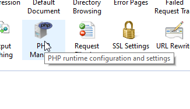
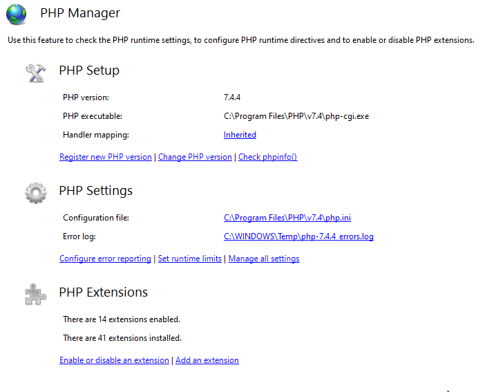

Confirm Request Methods
^^^^^^^^^^^^^^^^^^^^^^^

Check the Request Methods available to the Webserver / Fusio Application

Request methods can be set at a Web server wide and application level.

At the root node of IIS or in the Website configured for the Fusio application
open the settings "Handler Mappings":

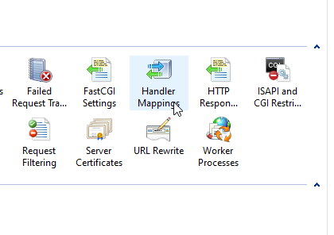

Find the mapping for PHP in the list. It is possible to have multiple versions
of PHP mapped so be sure to choose the one you have configured for your Fusio
website.

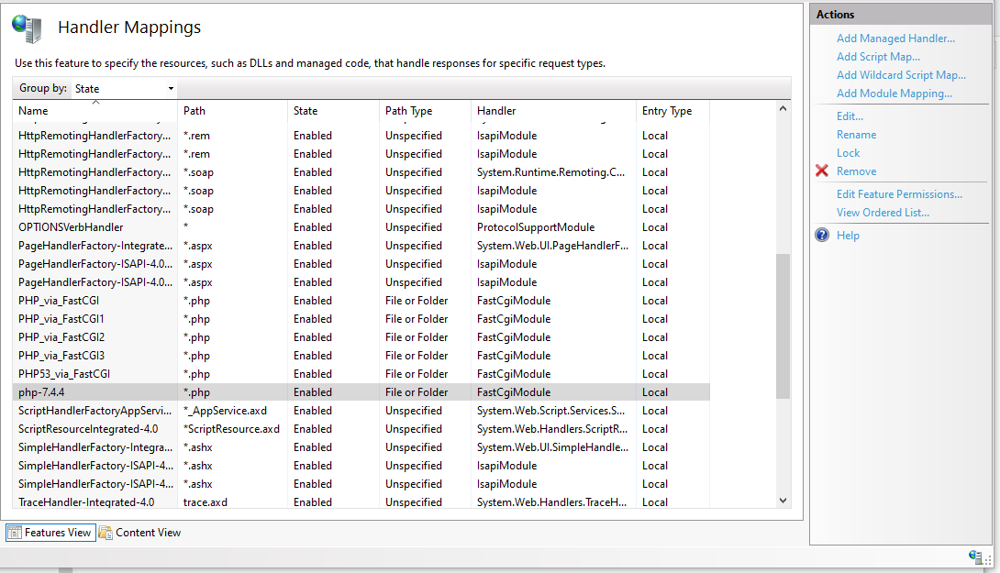

Click Request Restrictions:

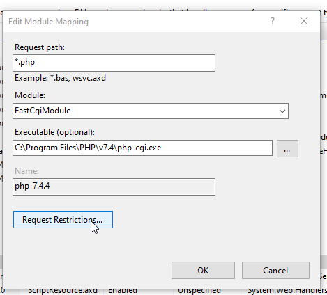

Choose the tab "Verbs":

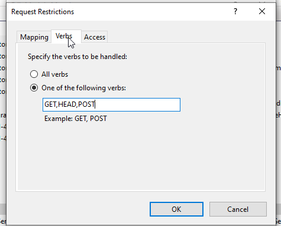

The IIS default does not include all of the request methods required by Fusio.
Fusio requires the following request methods to be active – ``GET,POST,PUT,DELETE``.
Add the required verbs or on a development machine choose "All verbs":

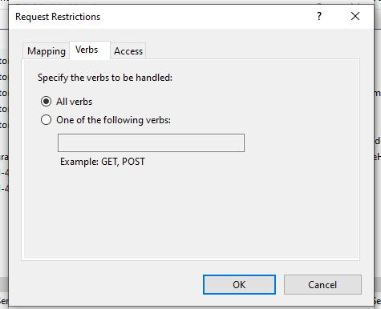

On the dialog "Edit Module Mapping" put speech marks around the Executable entry
before clicking OK:

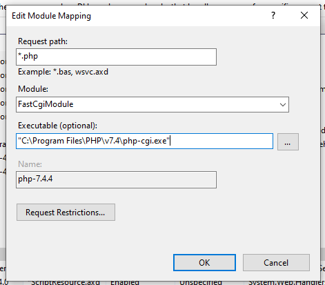

Click "Yes" in the check dialog:

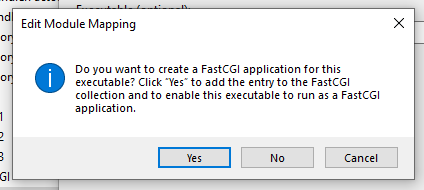

Setting Up URL Rewrite
^^^^^^^^^^^^^^^^^^^^^^

IIS has a plugin for Url Rewrite which must be installed via the Microsoft Platform
installer, before it can be configured:

* Install Web Platform Installer
* Install "Url Rewrite" IIS  plugin
* Configure "Url Rewrite" for Fusio website

Install Web Platform installer
""""""""""""""""""""""""""""""

If not already installed, install IIS Url Rewrite via the Web Platform Installer
https://www.microsoft.com/web/downloads/platform.aspx

Install "Url Rewrite" IIS plugin
""""""""""""""""""""""""""""""""

In IIS manager:

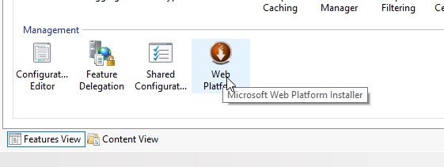

Search "url" and click add to install "URL Rewrite 2.1":

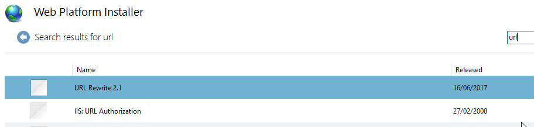

Configure "Url Rewrite" for Fusio website
"""""""""""""""""""""""""""""""""""""""""

Once installed click "Url Rewrite" in the Fusion website:

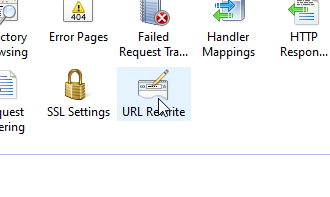

Url Rewrite rules can be imported from the .htaccess file, configured manually
or set directly in the web.config file in the public folder of the Fusio
installation:

* Import Rules from .htaccess
* Manual Url Rewrite Configuration
* Edit Web.config file

Import Rules from .htaccess
"""""""""""""""""""""""""""

Within Url Rewrite click "Import Rules" on the menu on the right:

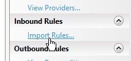

Click "…" to choose the .htaccess file in the public folder of the Fusio
installation:

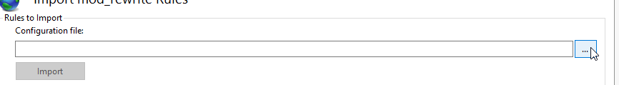

In the Fusion web application folders choose the "public" folder:

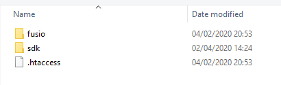

Click "Import"

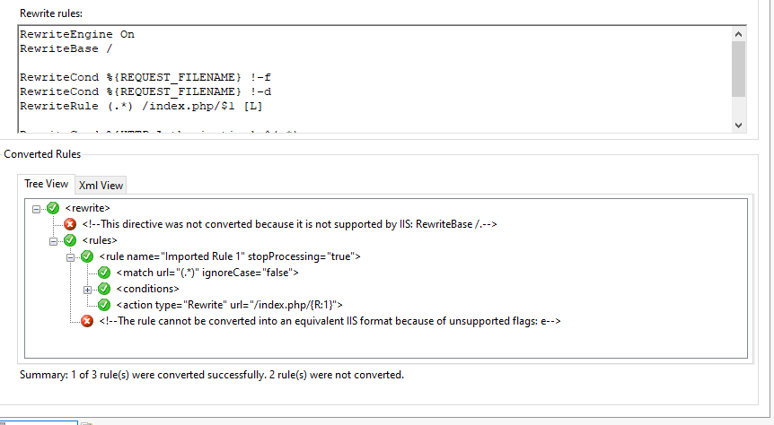

Two items need to be adjusted.

Click on the "<!—This directive…." And the error will be highlighted in the top
panel

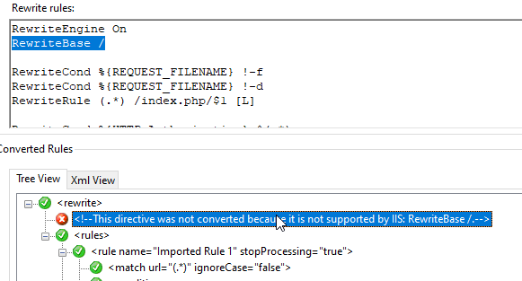

Delete the Entry "RewriteBase /" from the top panel.
Click "<!—rule cannot…" in the bottom panel:

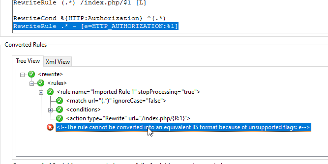

Delete the entry "RewriteRule .* - [e=HTTP_AUTHORIZATION:%1]" from the top panel.
Click "Apply" on the top right menu:

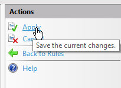
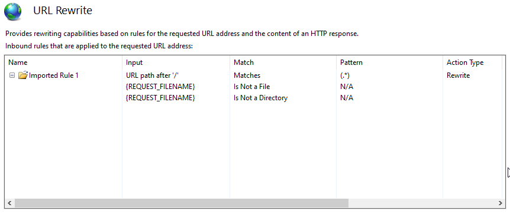

Manual Url Rewrite Configuration
""""""""""""""""""""""""""""""""

Match with regular expression and pattern (.*)

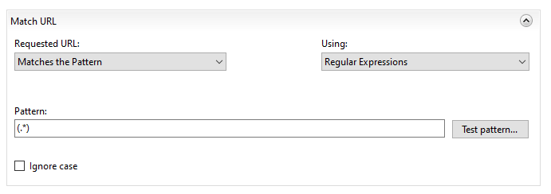

Conditions:

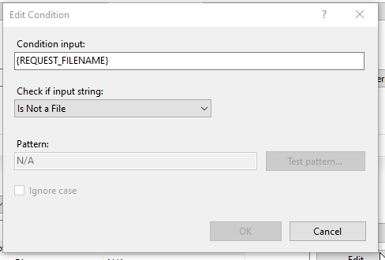
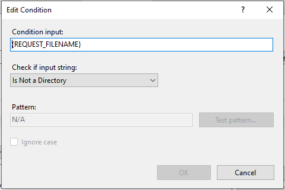

Action Rewrite ``/index.php/{R:1}``

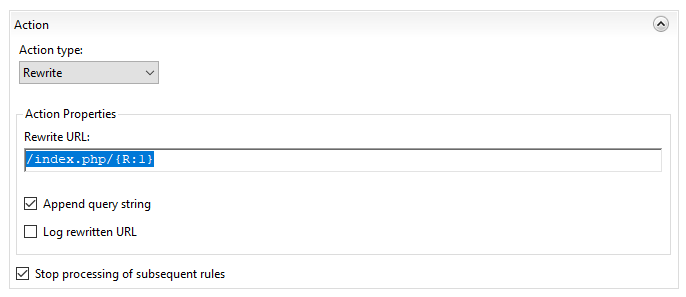

Edit Web.config file
""""""""""""""""""""

Located in the public folder e.g. ``C:\webapps\fusio.localhost.local\public\web.config``.
It is possible that this file includes other settings. The url rewrite settings
are under the <rewrite> node

.. code-block:: xml

    <?xml version="1.0" encoding="UTF-8"?>
    <configuration>
        <system.webServer>
            <rewrite>
                <rules>
                    <rule name="Imported Rule 1" stopProcessing="true">
                        <match url="(.*)" ignoreCase="false" />
                        <conditions logicalGrouping="MatchAll">
                            <add input="{REQUEST_FILENAME}" matchType="IsFile" ignoreCase="false" negate="true" />
                            <add input="{REQUEST_FILENAME}" matchType="IsDirectory" ignoreCase="false" negate="true" />
                        </conditions>
                        <action type="Rewrite" url="/index.php/{R:1}" />
                    </rule>
                </rules>
            </rewrite>
        </system.webServer>
    </configuration>

Debugging with XDebug
"""""""""""""""""""""

IIS requires "Non Thread Safe" dlls as extensions and so when downloading xDebug
choose the NTS version:

https://xdebug.org/download

Copy the required dll to the ext folder of your PHP folder e.g. ``C:\Program Files\PHP\v7.4\ext``
Add xdebug configuration to the php.ini in the PHP folder e.g. in the file
``C:\Program Files\PHP\v7.4\php.ini`` add the line:

.. code-block:: text

    zend_extension="C:\Program Files\PHP\v7.4\ext\php_xdebug-2.9.4-7.4-vc15-nts-x86_64.dll"

To activate xDebug for your application, either add the following to your php.ini
to activate xDebug for all web applications running on IIS:

.. code-block:: text

    xdebug.remote_autostart=1
    xdebug.remote_enable=On
    xdebug.remote_host=localhost 
    xdebug.remote_port=9000
    xdebug.remote_handler="dbgp"

or add a file to the web root ".user.ini" with this configuration to activate xDebug
for an individual application (preferred): e.g. ``C:\webapps\fusio.localhost.local\.user.ini``
This will limit debugging to the Fusio web application. IDE configuration is
dependent on the IDE you are using. Set ``autostart=0`` and ``remote_enable=Off``
to disable debugging.

Test Installation
-----------------

Enter ``fusio.localhost.local`` into your browser window and you should see:

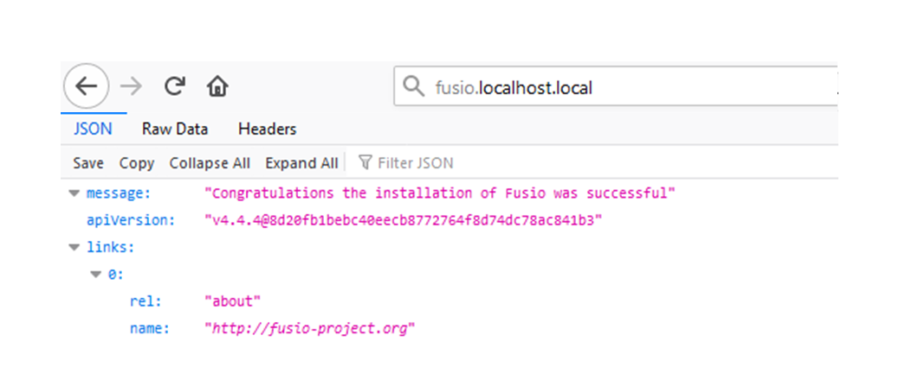

